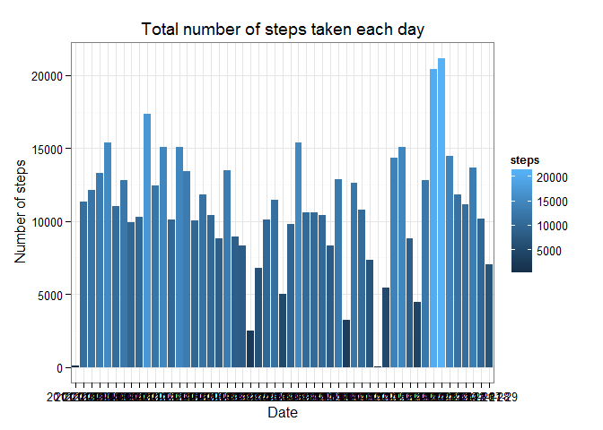
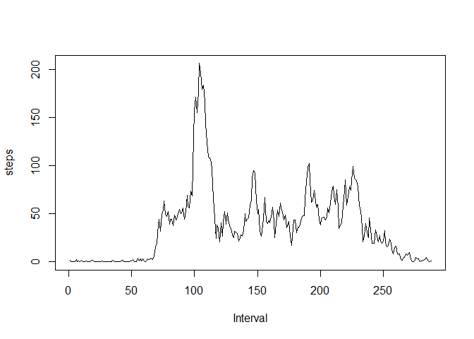
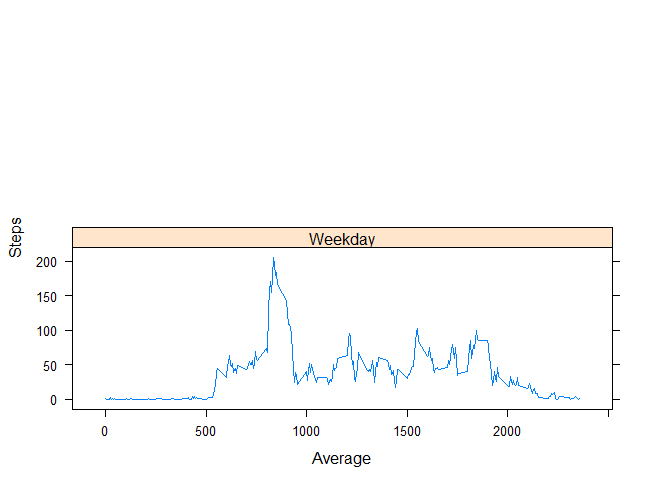

# Reproducible Research: Peer Assessment 1


## Loading and preprocessing the data (Url:https://d396qusza40orc.cloudfront.net/repdata%2Fdata%2Factivity.zip)

```r
DatFile <- "activity.csv"
if (!file.exists(DatFile)) { 
  unzip("repdata-data-activity.zip") 
}

DATF_activity <- read.csv( "activity.csv",
    sep=",",
    header=TRUE,
    na.strings="NA",
    colClasses=c("numeric", "character", "numeric"))
```

- Load the library for ploting

```r
if(!require('ggplot2')){
  install.packages('ggplot2')
}
```

```
## Loading required package: ggplot2
```

```r
library(ggplot2)
```

## What is mean total number of steps taken per day?

- Ignore the missing values in the dataset.
 

```r
Complete_DATF_activity <- DATF_activity[!is.na(DATF_activity$steps),]
```

- Make a histogram of the total number of steps taken each day

```r
Steps_Day <- aggregate(steps ~ date, data = Complete_DATF_activity, FUN=sum)


Result <- ggplot(Steps_Day, aes(x=factor(date), y=steps, fill=steps))
Result <- Result +  geom_bar(aes(fill = steps),position = "dodge", stat="identity")
Result <- Result + xlab("Date") +  ggtitle(expression("Total number of steps taken each day"))
Result <- Result +  labs(x = "Date") + labs(y = expression("Number of steps")) + theme_bw() 

print.eval=TRUE
print(Result)
```

 

- Calculate and report the mean and median total number of steps taken per day

```r
mean(Steps_Day$steps)
```

```
## [1] 10766.19
```

```r
median(Steps_Day$steps) 
```

```
## [1] 10765
```


## What is the average daily activity pattern?

- Make a time series plot (i.e. type = "l") of the 5-minute interval (x-axis) and the average number of steps taken, averaged across all days (y-axis)

```r
Time_Serie_Step <- aggregate(steps ~ interval, data=Complete_DATF_activity, FUN=mean)
with(Time_Serie_Step,{plot(steps,type="l",xlab = "Interval")})
```

 

- Which 5-minute interval, on average across all the days in the dataset, contains the maximum number of steps?

```r
Time_Serie_Step$interval[which.max(Time_Serie_Step$steps)]
```

```
## [1] 835
```


## Imputing missing values

- Calculate and report the total number of missing values in the dataset (i.e. the total number of rows with NAs)

```r
sum(is.na(DATF_activity$steps))
```

```
## [1] 2304
```

- Devise a strategy for filling in all of the missing values in the dataset. The strategy does not need to be sophisticated. For example, you could use the mean/median for that day, or the mean for that 5-minute interval, etc.


```r
Steps_Day <- aggregate(steps ~ date, data = DATF_activity, FUN=sum)
Activity_NO_NA <- merge(DATF_activity, Steps_Day, by="date", suffixes=c("","FILL"))
Na_Val <- is.na(Activity_NO_NA$steps)
```

- Create a new dataset that is equal to the original dataset but with the missing data filled in.

```r
Activity_NO_NA$steps[Na_Val] <- Activity_NO_NA$steps.new[Na_Val]
Activity_NO_NA <- Activity_NO_NA[,1:3]
```

- Make a histogram of the total number of steps taken each day and Calculate and report the mean and median total number of steps taken per day. 


```r
Steps_Day <- aggregate(steps ~ date, data = Activity_NO_NA, FUN=sum)


Result <- ggplot(Steps_Day, aes(x=factor(date), y=steps, fill=steps))
Result <- Result +  geom_bar(aes(fill = steps),position = "dodge", stat="identity")
Result <- Result + xlab("Date") +  ggtitle(expression("Total number of steps taken each day"))
Result <- Result +  labs(x = "Date") + labs(y = expression("Number of steps")) + theme_bw() 

print.eval=TRUE
print(Result)
```

 

- Do these values differ from the estimates from the first part of the assignment? 
No, they are equal.

- What is the impact of imputing missing data on the estimates of the total daily number of steps?

After imputing the missing data, the new mean of total steps taken per day is the same as that of the old mean; the new median of total steps taken per day is greater than that of the old median. The impact in minimal

## Are there differences in activity patterns between weekdays and weekends?

- Create a new factor variable in the dataset with two levels -- "weekday" and "weekend" indicating whether a given date is a weekday or weekend day.


```r
Find_Type_dayWeek <- function(date) {
	if(weekdays(as.Date(date)) %in% c("Saturday", "Sunday")) {
		day <- "Weekend"
	} else {
		day <- "Weekday"
	}
}
Activity_NO_NA$weekday_part <- as.factor(sapply(Activity_NO_NA$date, Find_Type_dayWeek))
```

- Make a panel plot containing a time series plot (i.e. type = "l") of the 5-minute interval (x-axis) and the average number of steps taken, averaged across all weekday days or weekend days (y-axis). The plot should look something like the following, which was created using simulated data:

```r
library(reshape2)
DF_Melt <- melt(Activity_NO_NA, measure.vars="steps")
Average_STP <- dcast(DF_Melt, weekday_part+interval~variable, mean)

library(lattice)

xyplot(steps~interval|weekday_part,
	data=Average_STP,	xlab="Average",	ylab="Steps",	type="l",	layout=c(1,2)
)
```

 
